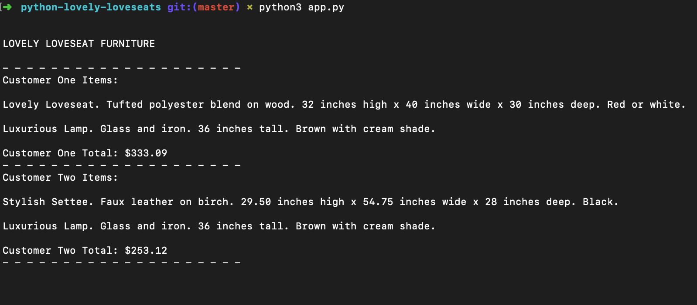

# Python-Lovely-Loveseats

Use strings and numbers to save a catalog of furniture, then perform concatenation and math calculations to create a receipt.

## Technology used

- `python3`

## What This Application Does

- Create a catalog and serve our first two customers.
- Use strings and numbers to create and update variables to store the names and prices of a furniture store's catalog
- Print out an itemized list and a total cost for each of our customers to the output terminal. Lovely!
